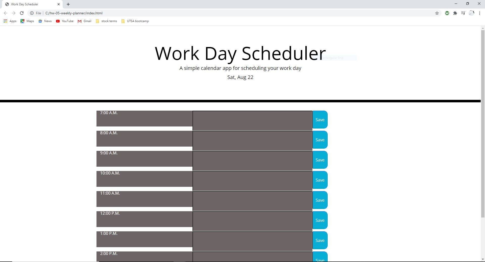

# 05 Third-Party APIs: Work Day Scheduler

This is a Work day planer: it has the time zone of 7 am to 4 pm and changes colors base on past, present and future.

This shows the time has passed and the history will not save if it is current or past the said time zone.
However the color of time pass was changed into a darker color to read text.

Thank you for your time,

 Author: Stephen Fink
 a link to final product 
 
 [Click me](https://stephenfink.github.io/hw-05-weekly-planner/.)
